# Analog Signal to Manchester Encoded Digital Signal Encoder

The project uses NG SPICE to Simulate a Encoder which can be used to convert an Analog Signal to Manchester Encoded Digital Data. The Encoder comprises of the following Major SubCircuits:

  - [Priority Encoder](#priority-encoder)
  - [Analog To Digital Converter (ADC)](#analog-to-digital-converter-adc)
  - [Parallel IN Serial OUT (PISO)](#parallel-in-serial-out-piso)
  - [Basic Gates](#basic-gates)
      - [NOT Gate](#1-not-gate)
      - [NAND Gate](#2-nand-gate)
      - [AND Gate](#3-and-gate)
      - [NOR Gate](#4-nor-gate)
      - [OR Gate](#5-or-gate)
      - [XOR Gate](#6-xor-gate)

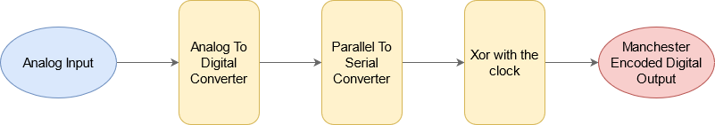

## Priority Encoder
It is a different type of encoder which is modified such that it gives a proper output even when there is more than one input which is high. As the name suggests, It gives the priority to the highest bit that is high and encodes it. No matter whether the lower bits are high or low, if one of the higher bits is high, the encoder gives the binary output of the higher bit. 
We have implemented a 8 - 3 Priority Encoder, quantizing the input into 8 levels. We use the following Truth Table:

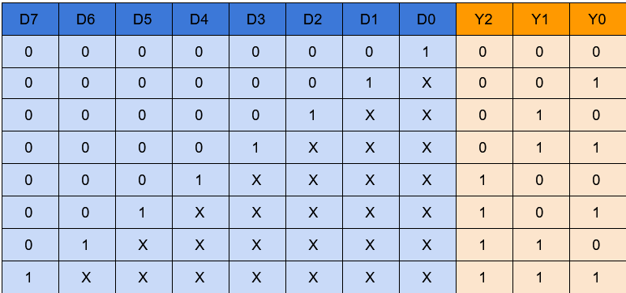

From the above Truth Table we can formulate the following Logic Equations:
<!-- 
$$
Y_2 = \Sigma(D_4 + D_5 + D_6 +D_7)
$$

$$
Y_1 = \Sigma(\bar{D_5}\bar{D_4}D_2 + \bar{D_5}\bar{D_4}D_2 + D_6 + D_7)
$$

$$
Y_0 = \Sigma(\bar{D_6}\bar{D_4}\bar{D_2}D_1 + \bar{D_6}\bar{D_4}D_3 + \bar{D_6}D_5 + D_7)
$$ -->

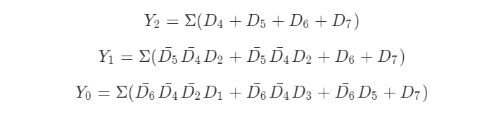

## Analog To Digital Converter (ADC)
We use the Priority Encoder Coupled with Comparators and a Voltage Divider to get the Quantized Digital Output of the input Analog Signal. We use the following Template:

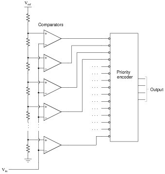

## Parallel IN Serial OUT (PISO)
The output from the ADC as we can see above, is parallel, whereas our transmission requires serial data. Hence we use a PISO circuit to overcome this.

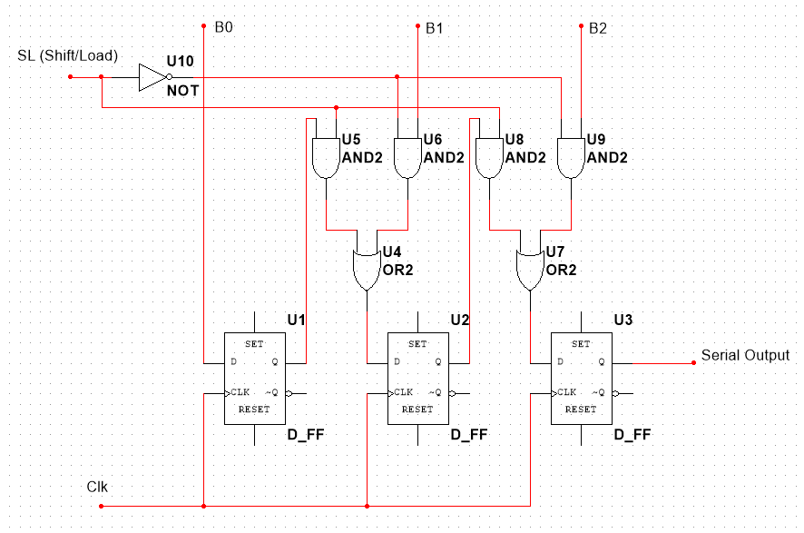

## Basic Gates
Using AOI, we tried to reduce the number of MOSFET's used in making each gate. The minimized form of the Logic gates were:

#### 1. NOT Gate

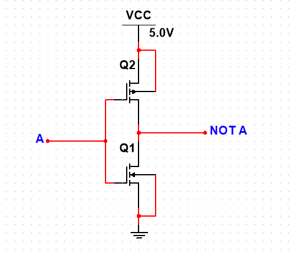

#### 2. NAND Gate

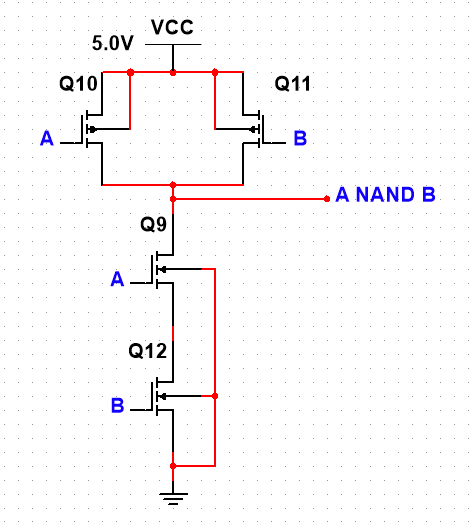

#### 3. AND Gate

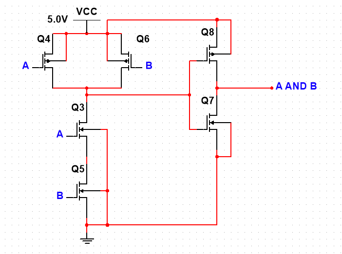

#### 4. NOR Gate

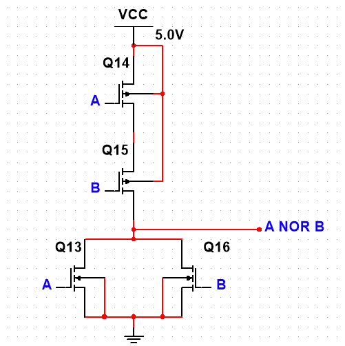

#### 5. OR Gate

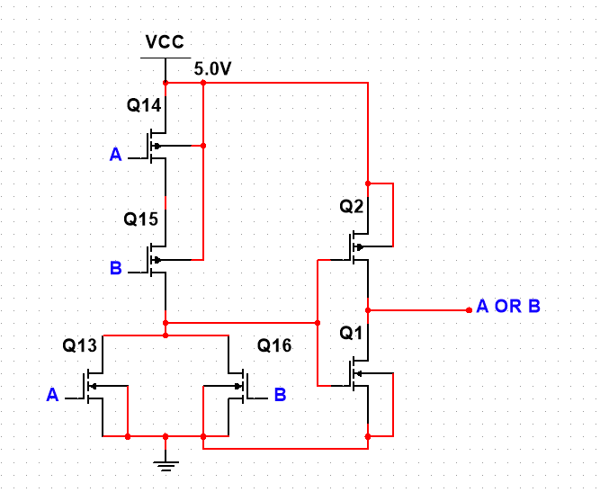

#### 6. XOR Gate

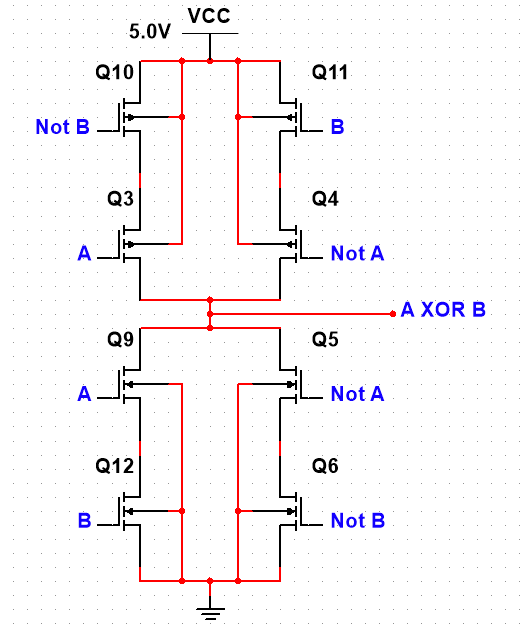

For More Information Refer To the Report through this [link](https://drive.google.com/file/d/1msZa1UPSvkY5PF6-qT103bYxw3pEaOKy/view?usp=sharing)